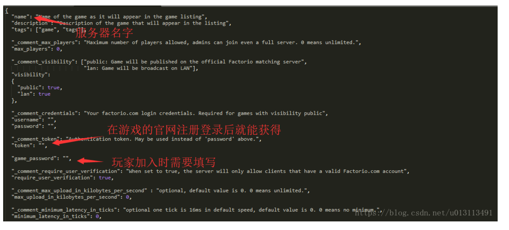

## 1、搭建服务器


### 1.1 Centos 7

如果系统是 centos 7 ，因为异星工厂服务器需要 glibc 2.18，而 centos 7 默认是不支持的，所以需要替换成 glibc 2.18

如果系统是 centos 8 直接略过这步骤

==用 2.18 替换 glibc 2.17==

```shell
yum groupinstall "Development tools"
yum install glibc-devel.i686 glibc.i686

cd /tmp
wget http://ftp.gnu.org/gnu/glibc/glibc-2.18.tar.gz
tar xvzf glibc-2.18.tar.gz
cd glibc-2.18
mkdir glibc-build
cd glibc-build
../configure --prefix='/usr'

# 将 if (/$ld_so_name/) { 替换为 if (/\Q$ld_so_name\E/) { 
nano +179 ../scripts/test-installation.pl
if (/$ld_so_name/) {
if (/\Q$ld_so_name\E/) { 

make
make install
```


### 1.2 Centos 8

```shell
# 去官网查看最新版本：https://factorio.com/download
wget https://www.factorio.com/get-download/0.16.36/headless/linux64

# 解压压缩包
tar -xvf linux64 -C /opt

# 进入 data 文件夹编辑文件，如下图一
vim data/server-settings.example.json

# 复制配置文件，不指定配置文件时，默认使用的是 server-settings.json，所以需要复制一份
cp server-settings.example.json  server-settings.json

# 创建存放文档的文件夹
./bin/x64/factorio --create ./saves/test1.zip

# 启动服务器，前台启动，如果关闭连接会直接停止服务器，推荐使用下面那个
/opt/factorio/bin/x64/factorio --config /opt/factorio/config/config.ini --port 34197 --start-server /opt/factorio/saves/2022年02月16日.zip --server-settings /opt/factorio/data/server-settings.json
# 启动服务器，前台启动
/opt/factorio/bin/x64/factorio --port 34197 --start-server /opt/factorio/saves/2022年02月16日.zip --server-settings /opt/factorio/data/server-settings.json

# 启动服务器，后台启动
nohup /opt/factorio/bin/x64/factorio --port 34197 --start-server /opt/factorio/saves/2022年02月16日.zip --server-settings /opt/factorio/data/server-settings.json > logs/2022年2月15日.log 2>&1 &

# 启动服务器，后台启动，并保存日志到固定文件中
nohup /opt/factorio/bin/x64/factorio --port 34197 --start-server /opt/factorio/saves/2022年02月16日.zip --server-settings /opt/factorio/data/server-settings.json > /opt/factorio/logs/2022年02月15日.log 2>&1 &

# 后台启动服务器，并使用最新存档
# >>：双引号是追加输入，单引号是覆盖，
# 2>&1：0 表示键盘输入 1表示屏幕输出 2表示错误输出，把标准出错重定向到标准输出，意思就是把所有标准输出和标准出错都写一起
# &：最后一个 & 的意思是后台运行，需搭配开头的 nohup 使用，启动后需要手动 exit 断开当前会话，直接关闭窗口不会生效
nohup /opt/factorio/bin/x64/factorio --port 34197 --start-server-load-latest --server-settings /opt/factorio/data/server-settings.json >> /opt/factorio/logs/2022年02月15日.log 2>&1 &

# 关闭服务器，根据服务器端口查询游戏进程ID
netstat -nlp |grep :34197

# 查询进程ID，杀死进程
kill -9 32554
```





## 2、配置文件解析

```json
{
    // 服务器名，
    "name": "2698570843", 
    "description": "Description of the game that will appear in the listing",
    "tags": [
        "game",
        "tags"
    ],
    "_comment_max_players": "Maximum number of players allowed, admins can join even a full server. 0 means unlimited.",
    // 允许玩家上限
    "max_players": 0,
    "_comment_visibility": [
        "public: Game will be published on the official Factorio matching server",
        "lan: Game will be broadcast on LAN"
    ],
    "visibility": {
        // 该服务器是否可在公共占据被搜索到，服务器在国外，网络不好建议关闭，直接使用服务器直连
        "public": true,
        // 局域网访问
        "lan": true
    },
    "_comment_credentials": "Your factorio.com login credentials. Required for games with visibility public",
    // 用户名、密码，可以不填，需要注册到公共服务器时需要配置
    "username": "",
    "password": "",
    "_comment_token": "Authentication token. May be used instead of 'password' above.",
    // 用户令牌Token，去官网注册时可以查看
    "token": "",
    // 好友连接服务器的密码
    "game_password": "",
    // 正版验证
    "_comment_require_user_verification": "When set to true, the server will only allow clients that have a valid Factorio.com account",
    "require_user_verification": true,

    "_comment_max_upload_in_kilobytes_per_second": "optional, default value is 0. 0 means unlimited.",
    "max_upload_in_kilobytes_per_second": 0,
    "_comment_max_upload_slots": "optional, default value is 5. 0 means unlimited.",
    "max_upload_slots": 5,
    "_comment_minimum_latency_in_ticks": "optional one tick is 16ms in default speed, default value is 0. 0 means no minimum.",
    "minimum_latency_in_ticks": 0,
    "_comment_max_heartbeats_per_second": "Network tick rate. Maximum rate game updates packets are sent at before bundling them together. Minimum value is 6, maximum value is 240.",
    "max_heartbeats_per_second": 60,
    // true：在此地图上玩过的玩家已经可以加入，即使达到了最大玩家限额。 
    "_comment_ignore_player_limit_for_returning_players": "Players that played on this map already can join even when the max player limit was reached.",
    "ignore_player_limit_for_returning_players": false,
    "_comment_allow_commands": "possible values are, true, false and admins-only",
    "allow_commands": "admins-only",
    // 自动存档时间
    "_comment_autosave_interval": "Autosave interval in minutes",
    "autosave_interval": 10,
    // 最多有几个存档，建议设置5~10个，方便回档，默认一个也没问题
    "_comment_autosave_slots": "server autosave slots, it is cycled through when the server autosaves.",
    "autosave_slots": 10,
    // 挂机多久会被踢
    "_comment_afk_autokick_interval": "How many minutes until someone is kicked when doing nothing, 0 for never.",
    "afk_autokick_interval": 0,
    // 当玩家都下线时，游戏是否暂停，true：暂停，false：不暂停游戏
    "_comment_auto_pause": "Whether should the server be paused when no players are present.",
    "auto_pause": true,
    // 只有管理员可以暂停游戏
    "only_admins_can_pause_the_game": true,
    // 自动保存是否应该只保存在服务器上，true：只保存在服务器上，false：保存在服务器和客户端中
    "_comment_autosave_only_on_server": "Whether autosaves should be saved only on server or also on all connected clients. Default is true.",
    "autosave_only_on_server": true,
    // 实验性功能，是否开启不停止保存
    "_comment_non_blocking_saving": "Highly experimental feature, enable only at your own risk of losing your saves. On UNIX systems, server will fork itself to create an autosave. Autosaving on connected Windows clients will be disabled regardless of autosave_only_on_server option.",
    "non_blocking_saving": false,
    // 网络设置，非必要不修改
    "_comment_segment_sizes": "Long network messages are split into segments that are sent over multiple ticks. Their size depends on the number of peers currently connected. Increasing the segment size will increase upload bandwidth requirement for the server and download bandwidth requirement for clients. This setting only affects server outbound messages. Changing these settings can have a negative impact on connection stability for some clients.",
    "minimum_segment_size": 25,
    "minimum_segment_size_peer_count": 20,
    "maximum_segment_size": 100,
    "maximum_segment_size_peer_count": 10
}
```

